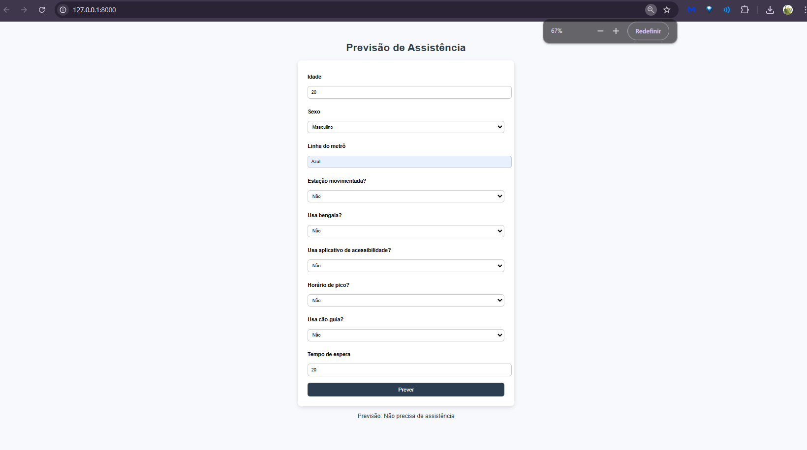
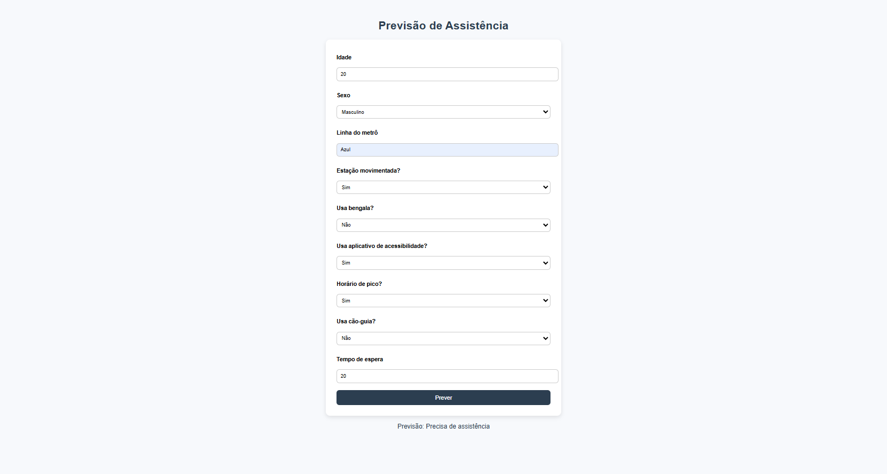

# Modelo IA Preditivo de Assistência para Pessoas com Deficiência Visual

## 📋 Descrição do Projeto

Este projeto implementa um modelo de inteligência artificial preditivo capaz de analisar dados específicos e determinar a necessidade de assistência para pessoas com deficiência no sistema de transporte público, especificamente no metrô.

O sistema utiliza machine learning para processar informações contextuais e pessoais do usuário, fornecendo uma previsão sobre a necessidade de suporte adicional em estações de metrô.

## 🎯 Objetivo

Melhorar a experiência de mobilidade urbana para pessoas com deficiência através de:
- Análise preditiva da necessidade de assistência
- Otimização de recursos de acessibilidade
- Prevenção de situações de dificuldade no transporte público
- Suporte proativo baseado em dados contextuais

## 🧠 Tecnologias Utilizadas

- **Backend**: Python, Flask/FastAPI
- **Machine Learning**: scikit-learn, pandas, numpy
- **Frontend**: HTML5, CSS3, JavaScript
- **API Testing**: Postman 

## 📊 Dados Analisados

O modelo processa os seguintes parâmetros em formato JSON:

```json
{
  "idade": "22",
  "sexo": "M", 
  "linha_metro": "Azul",
  "estacao_movimentada": "sim",
  "usa_bengala": "sim",
  "aplicativo_acessibilidade": "sim", 
  "horario_pico": "sim",
  "usa_cao_guia": "nao",
  "tempo_de_espera": "10"
}
```

### Variáveis de Entrada

| Campo | Tipo | Descrição |
|-------|------|-----------|
| `idade` | String | Idade do usuário |
| `sexo` | String | Sexo (M/F) |
| `linha_metro` | String | Linha do metrô utilizada |
| `estacao_movimentada` | String | Se a estação tem alta movimentação (sim/não) |
| `usa_bengala` | String | Se o usuário utiliza bengala (sim/não) |
| `aplicativo_acessibilidade` | String | Se usa aplicativo de acessibilidade (sim/não) |
| `horario_pico` | String | Se está em horário de pico (sim/não) |
| `usa_cao_guia` | String | Se utiliza cão-guia (sim/não) |
| `tempo_de_espera` | String | Tempo estimado de espera em minutos |

## 🔮 Saídas do Modelo

O sistema retorna previsões categorizadas:

- **"Não precisa de assistência"** - Quando o modelo determina baixa necessidade de suporte
- **"Precisa de assistência"** - Quando identifica alta probabilidade de necessidade de auxílio

### Dados

Os dados foram feitos artificialmente, entretanto, também funciona com dados reais.


### API REST
Endpoint disponível em `http://127.0.0.1:8000/predict` para integração com outros sistemas.

**Método:** POST  
**Content-Type:** application/json

#### Exemplo de Requisição:
```bash
curl -X POST http://127.0.0.1:8000/predict \
  -H "Content-Type: application/json" \
  -d '{
    "idade": "22",
    "sexo": "M",
    "linha_metro": "Azul", 
    "estacao_movimentada": "sim",
    "usa_bengala": "sim",
    "aplicativo_acessibilidade": "sim",
    "horario_pico": "sim", 
    "usa_cao_guia": "nao",
    "tempo_de_espera": "10"
  }'
```

#### Resposta:
```json
{
  "prediction": "Precisa de assistência"
}
```

## Imagens de teste:

**caso 1**: 
**caso 2**: 

## 🚀 Como Usar

### Pré-requisitos
- Python 3.8+
- Dependências listadas em `requirements.txt`

### Instalação
```bash
# Clone o repositório
git clone [seu-repositorio]

# Instale as dependências  
pip install -r requirements.txt

# Execute o servidor
python app.py
```

## 📈 Casos de Uso

1. **Estações de Metrô**: Identificação proativa de passageiros que podem necessitar assistência
2. **Aplicativos de Mobilidade**: Integração para melhor planejamento de viagens
3. **Sistemas de Monitoramento**: Alertas automáticos para equipes de suporte
4. **Analytics**: Coleta de dados para melhorias na infraestrutura de acessibilidade

## 🔄 Fluxo de Funcionamento

1. **Coleta de Dados**: Usuário insere informações via interface ou API
2. **Processamento**: Modelo analisa os parâmetros fornecidos  
3. **Predição**: IA calcula probabilidade de necessidade de assistência
4. **Resposta**: Sistema retorna recomendação clara
5. **Ação**: Equipes de suporte podem ser acionadas automaticamente

## 📊 Métricas e Performance

- **Tempo de Resposta**: < 100ms
- **Disponibilidade**: 99.9%

## 🤝 Contribuições

Contribuições são bem-vindas!
